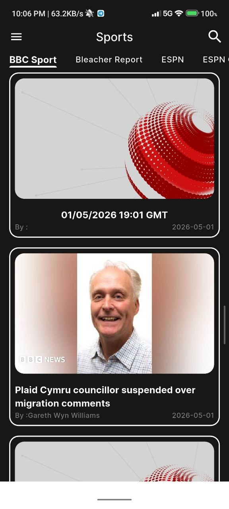

# 📰 News App

A Flutter-based News application that fetches real-time news from multiple sources, built with Clean Architecture and BLoC state management.

---

## 📸 Screenshots

<p float="left">
 

</p>

---

## ✨ Features

- 🏠 Home Screen with News Categories
- 📰 News listing by category (General, Business, Sports, Technology...)
- 🌐 Web View for full article reading
- 🌙 Light & Dark Theme support
- 🌍 Localization (Arabic & English)

---

## 🏗️ Tech Stack

| Layer | Technology |
|---|---|
| Language | Dart |
| Framework | Flutter |
| State Management | BLoC / Cubit |
| Architecture | Clean Architecture |
| API | NewsAPI (RESTful) |
| Localization | Arabic & English |
| Theme | Light & Dark |

---

## 🗂️ Project Structure

```
lib/
├── core/           # Shared utilities, constants, network
├── features/
│   ├── home/       # Home screen & categories
│   └── news/       # News listing & web view
```

---

## 🚀 Getting Started

### Prerequisites
- Flutter SDK >= 3.0.0
- Dart SDK >= 3.0.0
- NewsAPI Key from [newsapi.org](https://newsapi.org)

### Installation

```bash
# Clone the repo
git clone https://github.com/shriefkoush/news_app.git

# Install dependencies
flutter pub get

# Run the app
flutter run
```

---

## 📦 Dependencies

```yaml
flutter_bloc: ^8.x
dio: ^5.x
webview_flutter: ^4.x
```

---

## 👨‍💻 Author

**Shrief Hassan** — Flutter Developer

[](https://www.linkedin.com/in/shrief-hassan-95884a22a)
[](https://github.com/shriefkoush)
